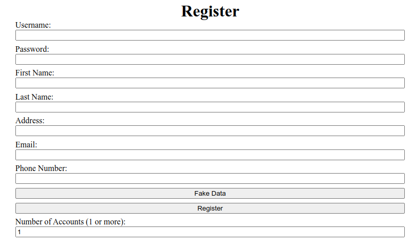
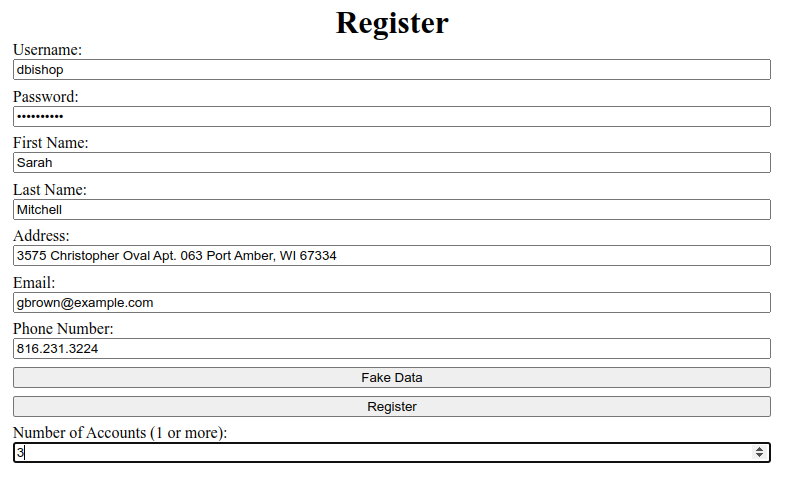

# Chat Simulator

---

## Project context

The project is for training purposes only and is not intended to actually create accounts or violate privacy policy.

## Requirements

1. The project must be written in the Python language.
2. The project must not use real phone numbers or other personal data when creating accounts.
3. The project must provide an interface (console or graphical) to interact with users.
4. The project must be able to generate random data (names, email addresses) for the accounts created.

## Functional requirements

1. The project must provide the ability for the user to specify the number of accounts to be created.
2. The project should create and save training account data in a convenient format (e.g., text file).

## Security requirements

The project must not use real personal data and must not violate privacy policy.

## Installation

1. Clone repository
2. Go to project folder and install dependencies to your environment:
    ```sh
    pip install requirements.txt
    ```
3. Install starlette separately:
    ```sh
    pip install starlette~=0.32.0
    ```

## Start Application

```sh
uvicorn main:app --reload --port 3001
```

OR

```sh
python3 main.py
```

## Examples

<table>
  <tr>
    <th colspan="3">Chat</th>
  </tr>
  <tr>
    <td colspan="3">
      <div style="text-align:center; border-radius: 10px; overflow: hidden; margin: 0 auto;">
        
      </div>
    </td>
  </tr>
  <tr>
    <th colspan="3">Login</th>
  </tr>
  <tr>
    <td colspan="3">
      <div style="text-align:center; border-radius: 10px; overflow: hidden; margin: 0 auto;">
        
      </div>
    </td>
  </tr>
  <tr>
    <th>Empty registration form</th>
    <th>Register multiple users</th>
    <th>Multiple register success message</th>
  </tr>
  <tr>
    <td>
      <div style="text-align:center; border-radius: 10px; overflow: hidden; margin: 0 auto;">
        
      </div>
    </td>
    <td>
      <div style="text-align:center; border-radius: 10px; overflow: hidden; margin: 0 auto;">
        
      </div>
    </td>
    <td>
      <div style="text-align:center; border-radius: 10px; overflow: hidden; margin: 0 auto;">
        
      </div>
    </td>
  </tr>
</table>